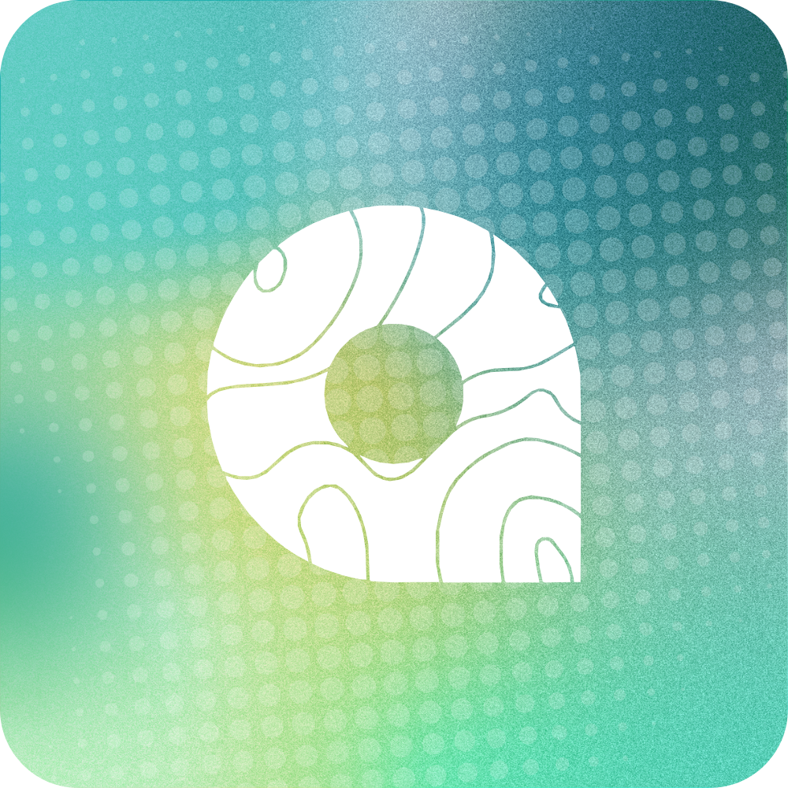

# MapaAyos

*Community-based reporting system designed to make reporting community problems easier and more transparent.*
All reports show up on a live map so everyone can see what’s happening and track the issue.

---

## 🛠 Tech Stack


---

## 📁 Project Structure

```
MapaAyos/
├── .htaccess              # Apache config for clean URLs and access rules
├── index.php              # Entry point of the application
├── config/                # Configuration files
├── database/              # Database schema and notes
├── public/                # Publicly accessible assets (CSS, JS, images)
├── src/                   # Application source code (logic, views, API)
│   ├── api/               # API endpoints (e.g., for AJAX requests)
│   ├── controllers/       # Business logic and interaction with models
│   ├── models/            # Database entities and queries
│   ├── scripts/           # App-specific JavaScript logic for roles/pages
│   ├── utils/             # PHP utility functions
│   └── views/             # PHP view templates rendered based on routing
│       ├── components/    # Resuable UI components
```

---

## 📌 Notes

- `src/` is strictly for application logic and should not be directly accessible via URL (use `.htaccess` to block access).
- `public/` is the only web-accessible directory; place all user-facing assets here (CSS, JS, images).
- Go to `database/` to initialize the tables and data needed.a
- Update `.htaccess` to accomodate new routes/pages.

---

### Group Members:

[](https://github.com/gian-gg) [](https://github.com/AlobaLoy) [](https://github.com/osbev) [](https://github.com/NinoRama) [](https://github.com/watsonjph)
